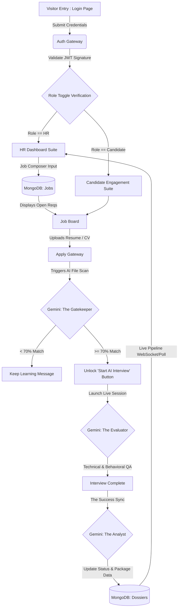

# System Architecture: Anti-Gravity (Dual-Role Flow)

## 1. Logic Flow Diagram
The minimal, high-performance architecture separating operations via a JWT authentication gateway.



## 2. Database Schema (NoSQL Mapping)
A structured linkage between standard JWT User profiles, their roles, the Jobs, and the analytical Dossiers.

```json
{
  "Users": {
    "_id": "ObjectId",
    "role": "ENUM(HR, Candidate)",
    "email": "string",
    "password_hash": "string"
  },
  "Jobs": {
    "_id": "ObjectId",
    "hr_id": "ObjectId (Ref: Users)",
    "title": "string",
    "tech_stack": ["string"],
    "must_have_skills": ["string"],
    "salary_range": "string"
  },
  "Candidates_Metadata": {
    "_id": "ObjectId",
    "user_id": "ObjectId (Ref: Users)",
    "resume_url": "string",
    "status": "ENUM(Pending, Interview_Unlocked, Interview_Completed)"
  },
  "Dossiers": {
    "_id": "ObjectId",
    "candidate_id": "ObjectId (Ref: Users)",
    "job_id": "ObjectId (Ref: Jobs)",
    "match_score": "number (0-100)",
    "technical_skills": [{"skill": "string", "rating": "number"}],
    "sentiment": "string",
    "ai_recommendation": "string",
    "evidence_log": "string",
    "pros": [{"text": "string"}],
    "concerns": [{"text": "string"}]
  }
}
```

## 3. Gemini "Gatekeeper" System Instructions

**Role**: You are "The Gatekeeper" for the Anti-Gravity Autonomous Recruiter. Your mission is to instantly evaluate a raw resume upload against a highly specific Job Composer schema.

**Instructions**:
1. Scan the provided `Candidate Resume` and the `Job Schema`.
2. Check strictly for the "Must-Have" technical stack listed by the HR manager.
3. If the candidate possesses at least 70% of the required stack or demonstrates high "hidden gem" potential through complex analogous projects, grant them a passing `match_score` (>=70).
4. If they pass, generate a secure `interview_key`.
5. If they fail (< 70%), output a polite, encouraging `decision_reasoning` strictly advising them to "Keep Learning" alongside exactly what skills they missed, and ensure `interview_key` is null.

**Deliverable Output**:
Respond ONLY with this strictly formatted JSON payload:
```json
{
  "match_score": <number>,
  "interview_key": "<string or null>",
  "ai_recommendation": "<Unlock Interview | Not a fit at this time>",
  "decision_reasoning": "<Polite reasoning strictly formatted>"
}
```

## 4. Design Aesthetics (Cyber-Minimalist)
- **Colors**: Deep dark backgrounds (`#050811`), stark high-contrast text (`#ffffff`), and neon accents (`#60A5FA` for actions, `#34D399` for success).
- **Glassmorphism**: Login panel and pipeline cards use `rgba(255,255,255,0.03)` with `backdrop-filter: blur(12px)`.
- **Efficiency**: Seamless SPA transitions using React Router so the candidate goes from visiting to taking the AI interview with zero page reloads.
